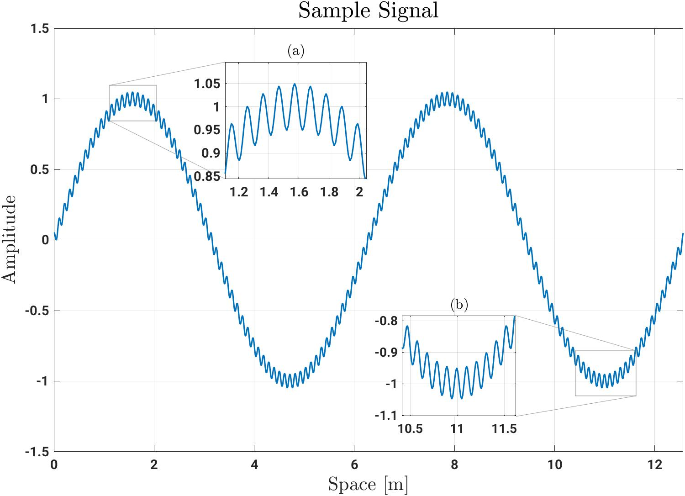

# Matlab Zoomed Axes

Adds a new class for creating nested axes that show zoomed-in regions of a 2D plot.
Supports multiple zoomed axes per parent and is fully interactive for easy placement. Allows multiple zoomed axes per plot

<div align="center">

</div>

## Initializing The Nested Axes
Given an existing axes, `ax` that holds data, one can create a nested axes zooming in on a box region defined by
`[x_min, y_min, x_max, y_max]` by calling the method `zoomed_axes(parent_axes, zoom_region)`:

```matlab
ax = axes();
zoom_region = [0 0 1 1];
zoom_ax = zoomed_axes(ax, zoom_region);
```
This will create a box on axes `ax` that shows the zoomed region and a new zoomed_axes type `zoom_ax`. For 
most use cases, the `zoomed_axes` object can be treated as a regular axes object. For more information on this,
view the Class Structure section below. 

## Adjusting The Nested Axes
Once created, the `zoomed_axes` graphics objects are fully interactable and can be sized and placed with your mouse. Both the box plotted on the parent axes
and the nested axes itself can be resized by clicking and dragging the corners or moved around by clicking and dragging any other part of the object. Panning and zooming inside of the
nested axes will automatically update the box on the parent axes depicting the zoomed region. Once the placement is to your liking, you can print the bounds of the current zoomed 
region by calling the method `zoomed_axes.print_zoom_region()` and assign this in your script to either the original `zoomed_axes()` call or by directly setting the `zoomed_axes.ZoomRegion` property. 
in your script. You can likewise get the position of the nested axes by calling `zoomed_axes.print_axes_position()` and assign it to the `zoomed_axes.Position` property. Please view the 
example directory to see an example that produces the plot at the top of this page, as well as a version that includes the animation of the signal.
 
## Class Structure
The `zoomed_axes` class contains the following public interface

```
zoomed_axes
|-- properties
|   |-- Axes
|   |-- ParentAxes
|   |-- Box
|   |-- BoxConnectors
|   |-- ParentFigure
|   |-- Type
|   |-- ZoomRegion
|-- methods
|   |-- print_zoom_region()
|   |-- print_axes_position()
```

| Property/Method             | Description                                                                                                              |
|-----------------------------|--------------------------------------------------------------------------------------------------------------------------|
| Axes                        | Handle for the nested axes                                                                                               |
| ParentAxes                  | Handle to axes that `Axes` is nested in                                                                                  |
| Box                         | Handle to the patch object that creates the box around `ZoomRegion`. Can be directly edited to ajdust color, alpha, etc...    |
| BoxConnectors               | Vector of handles to the patch objects that create the connectors between `Axes` and `Box`. Can be directly edited to ajdust color, alpha, etc...     |
| ZoomRegion                  | 4-element vector that defines the zoomed-in region on `ParentAxes`. Of the form `[x_min y_min x_max y_max]`. Can be directly edited and will auto-update all components |
| ParentFigure (read-only)    | Handle for overarching figure that contains `ParentAxes`                                                                 |
| Type (read-only)            | Type of this object. Is set to 'zoom_axes'                                                                               |
| print_zoom_region(format)   | Prints the current `ZoomRegion` to the console. Optional argument `format` allows specification of the print format string |
| print_axes_position(format) | Prints the current position of `Axes` to the console. Optional argument `format` allows specification of the print format string|

calling usual axes functions on a `zoomed_axes` object will forward them to the `zoomed_axes.Axes` handle, allowing you to call functions
such as `title()`, `xlabel()`, `ylabel()`, etc. on the `zoomed_axes` object directly and have them applied to the nested axes. Liekwise, all properties
that are directly accessed are forwarded to the `zoomed_axes.Axes`, with the exception of properties found in the top level of the `zoomed_axes` type. 
E.g. one can set the nested axes x-limits via any of the following methods
```matlab
xlim(zoom_ax, [x_min, x_max]); % using the xlim() function directly on the zoomed_axes object
xlim(zoom_ax.Axes, [x_min, x_max]); % using xlim() on the handle of the nested axes directly
zoom_ax.XLim = [x_min, xmax]; % directly accessing the xlim property by operating on the zoomed_axes object
zoom_ax.Axes.XLim = [x_min, x_max]; % directly accessing the xlim property of the nested axes
```